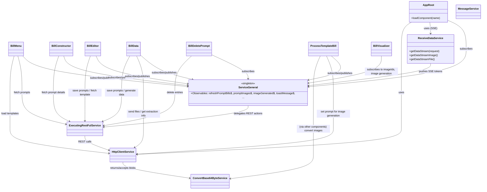

# System Architecture

This document provides a high-level overview of the main frontend modules and services and how they interact. The diagram below is a Mermaid class diagram illustrating component ↔ service relationships and primary flows.

Notes

- `ServiceGeneral` is the central event bus: most components subscribe to its Observables and publish events (refresh triggers, selected prompt updates, UI state like `setIsUploadingAnimation`).
- `ExecutingRestFulService` coordinates higher-level REST operations; it often calls `HttpClientService` to perform HTTP requests.
- `ReceiveDataService` provides server-sent/event-streams (SSE) used by streaming features and real-time prompt/image generation.
- Components typically follow the `takeUntil(destroy$)` subscription pattern to avoid memory leaks.

Location

- File: [system_architecture.md](system_architecture.md)
